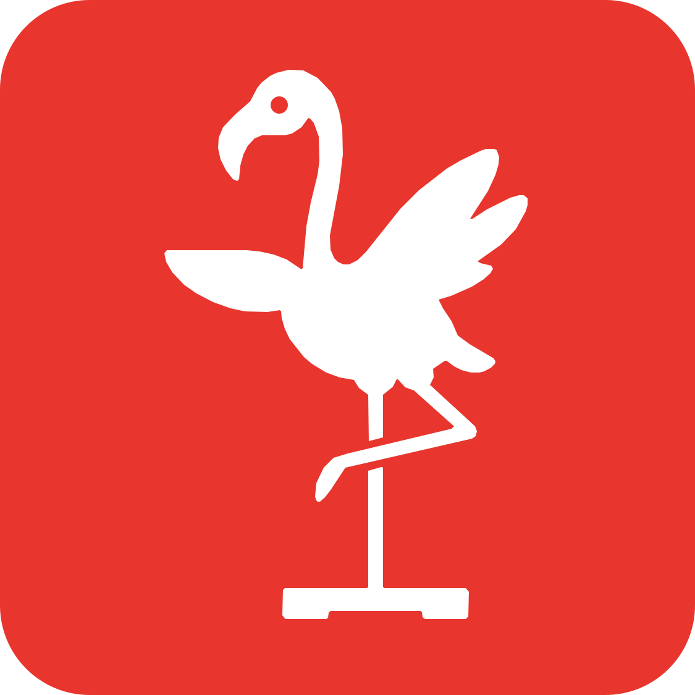

<table border="0">
  <tr>
    <td width="90" valign="middle" align="center">
      <a href="../README.md"></a>
    </td>
    <td valign="middle">
      <h1>Game Engine Integration &middot; Unity</h1>
      <p><strong>The Balance Toolkit - Apps</strong></p>
    </td>
  </tr>
</table>

[← All apps](../README.md) &middot; [Windows](../windows/) &middot; [Android](../android/) &middot; **Unity** &middot; [Python](../python/) &middot; [Source code](https://github.com/trecitano/The-Balance-Toolkit)

---

> This is part of **The Balance Toolkit - Apps**, the software accompanying our CHI PLAY 2026 paper. See the [main README](../README.md) for the full overview.

Unity scripts for receiving **Wii Balance Board** center-of-pressure (COP) data from [The Balance Toolkit](../windows/) desktop application and mapping it to GameObject movement in your scene. Two connection methods are provided: **TCP** (no dependencies) and **LSL** (requires LSL4Unity).

---

## Contents

| Script | Protocol | Dependencies |
|---|---|---|
| `BalanceBoardControllerTCP.cs` | TCP socket | None |
| `BalanceBoardControllerLSL.cs` | Lab Streaming Layer | [LSL4Unity](https://github.com/labstreaminglayer/LSL4Unity) |

Both scripts expose the same core behaviour: they receive an 8-channel data stream (`timestamp, mac_address, top_right, bottom_right, top_left, bottom_left, cop_x, cop_y`), and smoothly move the attached GameObject within the bounds of a parent plane according to the COP values.

---

## Quick Start

### 1. Scene Setup

1. Create a **Plane** (or Quad) in your scene — this defines the movement area.
2. Create a child **GameObject** (e.g., a Sphere) under that plane — this is the cursor that will move with the balance board.
3. Attach **one** of the controller scripts to the child object.

```
Scene Hierarchy
└── MovementPlane        ← assign as "Parent Plane"
    └── Cursor (Sphere)  ← attach controller script here
```

### 2. Choose Your Connection Method

#### Option A: TCP (Recommended — Zero Dependencies)

1. Add `BalanceBoardControllerTCP.cs` to your cursor GameObject.
2. In the Inspector, configure:
   - **Server Address** — IP of the machine running The Balance Toolkit (default `127.0.0.1`).
   - **Server Port** — TCP port (default `11223`).
   - **Stream Name** — must match the stream name in The Balance Toolkit (default `the-balance-toolkit_basic`).
3. Start The Balance Toolkit's TCP server, then press Play in Unity.

#### Option B: LSL

1. Import [LSL4Unity](https://github.com/labstreaminglayer/LSL4Unity) into your project.
2. Add the scripting define symbol `LSL_AVAILABLE`:
   - Go to **Edit → Project Settings → Player → Other Settings → Scripting Define Symbols**.
   - Add `LSL_AVAILABLE` and click **Apply**.
3. Add `BalanceBoardControllerLSL.cs` to your cursor GameObject.
4. In the Inspector, set the **Stream Name** to match your Balance Toolkit LSL stream.
5. Start the LSL stream, then press Play in Unity.

> **Note:** Without the `LSL_AVAILABLE` define, the LSL script will disable itself and log an error — this is by design so your project compiles even without LSL4Unity installed.

---

## Inspector Settings

### Shared Settings (Both Scripts)

| Property | Type | Description |
|---|---|---|
| **Stream Name** | `string` | Name of the Balance Toolkit data stream. Must match exactly. |
| **Parent Plane** | `Transform` | The plane defining the movement area. Auto-detects the parent transform if left empty. |
| **Smoothing Factor** | `float` (1–20) | Higher values = snappier response; lower values = smoother but laggier movement. |
| **Objects to Hide** | `GameObject[]` | GameObjects whose `MeshRenderer` or `SkinnedMeshRenderer` will be hidden on connection and restored on disconnection. Useful for hiding placeholder visuals. |
| **Show Debug Info** | `bool` | Enables an on-screen HUD and console logs showing connection status, COP values, sensor data, and sample rate. |

### TCP-Only Settings

| Property | Type | Description |
|---|---|---|
| **Server Address** | `string` | IP address of the TCP server (default `127.0.0.1`). |
| **Server Port** | `int` | TCP port (default `11223`). |
| **Auto Reconnect** | `bool` | Automatically attempt to reconnect on disconnection. |
| **Reconnect Delay** | `float` | Seconds between reconnection attempts. |
| **Max Reconnect Attempts** | `int` | Number of retries before giving up. |

---

## How It Works

1. **Connection** — On `Start()`, the script connects to the Balance Toolkit data stream (TCP socket or LSL inlet).
2. **Data Reception** — Incoming samples are parsed on a background thread (TCP) or polled each frame (LSL). The expected format per sample is 8 floats: `timestamp, mac_address, top_right, bottom_right, top_left, bottom_left, cop_x, cop_y`.
3. **COP Mapping** — The `cop_x` and `cop_y` values (normalised to approximately −1 to +1) are mapped to world-space positions within 90% of the parent plane's bounds.
4. **Smoothing** — The cursor position is interpolated each frame using `Vector3.Lerp` with the configured smoothing factor.
5. **Cleanup** — On disconnect or scene exit, the connection is closed, hidden objects are restored, and the cursor resets to the centre of the plane.

---

## Public API

Both scripts expose the following read-only properties you can access from other scripts:

```csharp
// Example: reading COP from another script
var controller = GetComponent<BalanceBoardControllerTCP>();

bool connected     = controller.IsConnected;
Vector2 cop        = controller.CenterOfPressure;  // normalised COP (x, y)
float[] sensors    = controller.SensorValues;       // [TL, TR, BL, BR]
int sampleRate     = controller.SamplesPerSecond;
float mac          = controller.MacAddress;
```

### Methods

| Method | Description |
|---|---|
| `Connect()` | Manually initiate connection. |
| `Disconnect()` | Disconnect and reset. |
| `ResetToCenter()` | Reset cursor to the centre of the parent plane. |

The TCP version additionally exposes:

| Method | Description |
|---|---|
| `ResetReconnectCounter()` | Reset the reconnect attempt counter and re-enable auto-reconnect. |

All methods are also available via **right-click → Context Menu** on the component in the Inspector.

---

## Debug Visualisation

When **Show Debug Info** is enabled:

- **On-screen HUD** — displays connection status, stream info, MAC address, sample rate, COP coordinates, and individual sensor values.
- **Scene Gizmos** (visible when the object is selected) — a yellow wireframe shows the parent plane bounds, a red sphere marks the current COP target, and a cyan line connects the plane centre to the COP position.

---

## Troubleshooting

| Symptom | Cause | Fix |
|---|---|---|
| `No parent plane assigned!` | Parent Plane field is empty and the object has no parent in the hierarchy. | Assign a Transform to **Parent Plane** or make the object a child of your movement plane. |
| LSL script disables itself | `LSL_AVAILABLE` scripting define is missing. | Add it in Project Settings → Player → Scripting Define Symbols. |
| `Connection failed` (TCP) | The Balance Toolkit TCP server is not running or the address/port is wrong. | Verify the server is running and check **Server Address** and **Server Port**. |
| No movement / 0 samples/sec | Stream name mismatch. | Ensure **Stream Name** in Unity matches the name configured in The Balance Toolkit. |
| Jerky movement | Smoothing factor too high. | Lower the **Smoothing Factor** for smoother interpolation. |
| Cursor overshoots plane edges | COP values exceed ±1. | The scripts clamp values to ±1 internally — check that your Balance Toolkit calibration is correct. |

---

## Data Format Reference

Each sample from The Balance Toolkit contains 8 channels:

| Index | Channel | Description |
|---|---|---|
| 0 | `timestamp` | Sample timestamp |
| 1 | `mac_address` | Board MAC address (as float) |
| 2 | `top_right` | Top-right sensor (kg) |
| 3 | `bottom_right` | Bottom-right sensor (kg) |
| 4 | `top_left` | Top-left sensor (kg) |
| 5 | `bottom_left` | Bottom-left sensor (kg) |
| 6 | `cop_x` | Centre of pressure X (normalised) |
| 7 | `cop_y` | Centre of pressure Y (normalised) |

---

## Requirements

- **Unity** 2020.3 LTS or later
- **The Balance Toolkit** running and streaming data
- **(LSL only)** [LSL4Unity](https://github.com/labstreaminglayer/LSL4Unity) package + `LSL_AVAILABLE` scripting define symbol

---

## Citation

This software accompanies our CHI PLAY 2026 paper. If you use The Balance Toolkit in your research, please cite it.

**APA**

> Valente, A., Kothari, N., Ahmed-Mahmoud, H., Esteves, A., & Billinghurst, M. (2026). The Balance Toolkit: Democratizing balance-based interaction through open-source software for repurposed Wii Balance Boards. In *Proceedings of the Annual Symposium on Computer-Human Interaction in Play (CHI PLAY '26)*. ACM.

**BibTeX**

```bibtex
@inproceedings{valente2026balancetoolkit,
  title     = {The Balance Toolkit: Democratizing Balance-Based Interaction
               Through Open-Source Software for Repurposed Wii Balance Boards},
  author    = {Valente, Andreia and Kothari, Nidhi and Ahmed-Mahmoud, Hana
               and Esteves, Augusto and Billinghurst, Mark},
  booktitle = {Annual Symposium on Computer-Human Interaction in Play (CHI PLAY '26)},
  year      = {2026},
  address   = {York, UK},
  publisher = {ACM}
}
```

DOI to be added on publication.

---

<sub><a href="../README.md">The Balance Toolkit - Apps</a> &middot; The Empathic Computing Laboratory, University of Auckland</sub>
